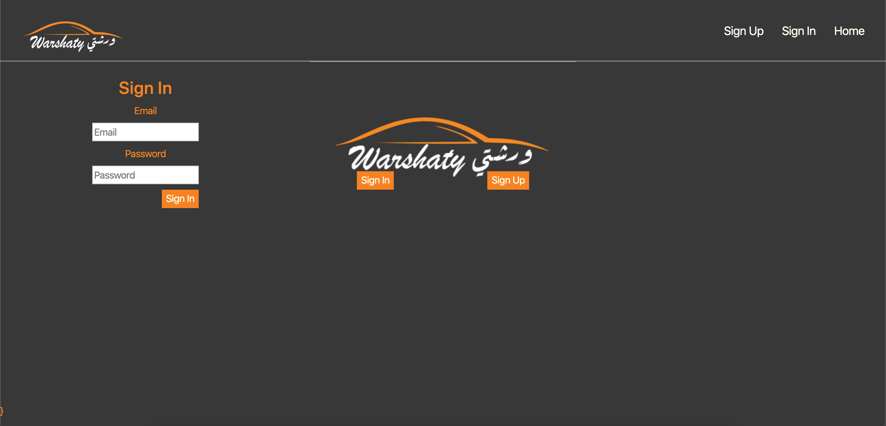

# Repair Shop Management 


Our project serve the Repair shop to manage the customer they comes-in and  them to tracking their progress and status of the car also the main details of car needed.

* User represent the owner of the repair shop
* Customer belong to one User wich
The project has many useful outcomes when the project use by a huge number of repair shops with a large number of cases that help up to improve and avoid damage from happening 


## Table of Contents

- [Background](#background)
- [User Story](#user-story)
- [Entity Relationship Diagram](#entity-relationship-diagram)
- [Wireframe](#wireframe)
- [Technology](#technology)
- [Further Study](#further-study)
- [Team Member](#team-member)

## Background
Nowadays in case of car accident or get damage for any reason we immediately go to repair shop to fixed the damages with hard way to contact with the shop and for tracking your car progress, so this system will provide a number of servieces to the customer's shop and the repaire shop itself.
The system will help the shop to orgnaize the all work order inside his shop to allow him to access to any case in a short time, and he can compare the income problem with the old one that allready fixed in the system stored.


## User Story 
* The owner of the repair shop "User"
1. Register in the system as a user
2. The user have the ability to add Customer
3. For every customer abile to add cars
4. For every car can have one Work Order on the same time.


## Entity Relationship Diagram


## Wireframe




## Technology
 
* [npm](https://www.npmjs.com/package/download).
* [Node js](https://nodejs.org/en/download/).
* [React js](https://react-cn.github.io/react/downloads.html).
* [Express js ](https://expressjs.com/en/starter/installing.html).
* [VScode](https://code.visualstudio.com/download).
* [Postman](https://www.getpostman.com/downloads/).
* [Adobe Photoshop and illustrator](https://www.adobe.com/downloads.html).
* [figma](https://www.figma.com/downloads/).
* Template 

We use this template for authentication
```  
express:  https://github.com/sei-relativity/express-api-template
react: https://github.com/sei-relativity/react-template
```


## Further Study

* Improve the work order to make it incloude enouph deitals.
* Make the system print out the bill to the customer after the work order done.
* Make the customer tracking his work order
* 

## Team Member

* [@MuhannadCY](https://github.com/MuhannadCY).
* [@Abdulrhman-J](https://github.com/Abdulrhman-J).
* [@wahhab1404](https://github.com/wahhab1404).
